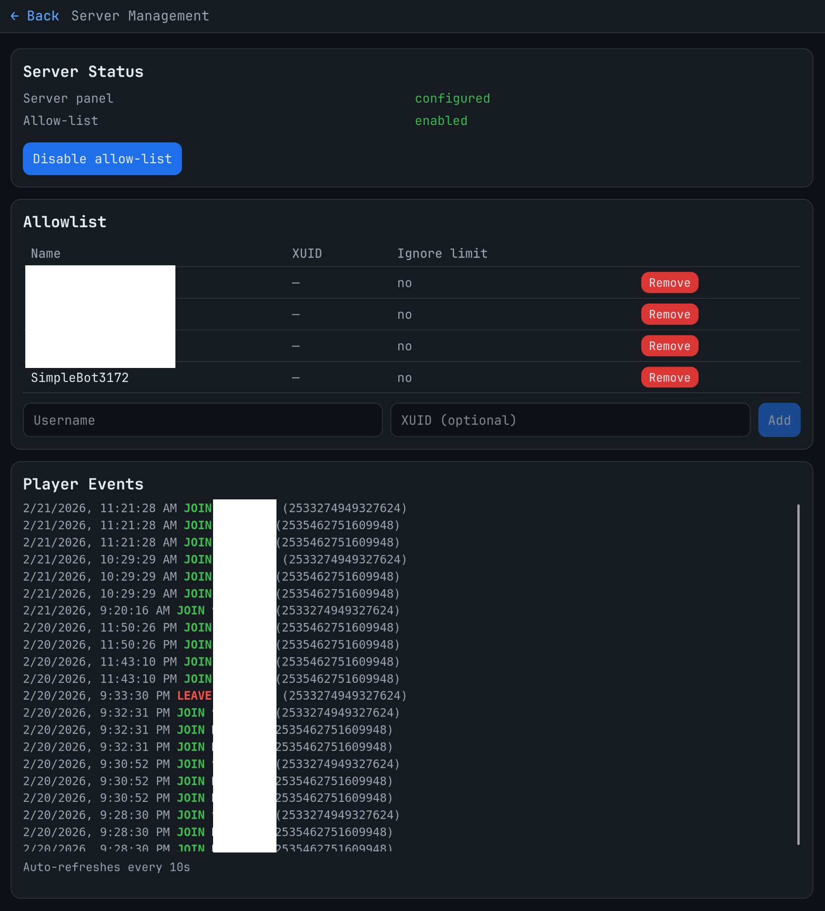

# Building with Claude Code

For everything vibe code related Claude is awesome to build a couple of projects. The workflow is basically: describe what you want, review what it writes, iterate. It's pretty good at keeping context across a whole project and not just spitting out isolated snippets. Just need to ask to save info in memory from time to time, its not like GPT that will just start hang in long "chats", it automatically resets and gives itself context.

## Minecraft Server Admin Panel

My Minecraft Bedrock server needed a proper management interface — I was tired of SSH-ing in every time I wanted to add someone to the allowlist or check if the server was still up.

Built a web app using Node.js + Express + Socket.IO with a vanilla JS frontend. It reads and writes `allowlist.json`, `permissions.json`, and `server.properties` directly, controls the systemd service, and streams live logs to the browser via WebSocket.

Runs in a Docker container with the systemd socket mounted so it can actually start/stop the service.

Stack: Node.js, Express, Socket.IO, HTML/CSS/JS (no framework)

<!-- screenshot: mc admin panel web UI -->

*Still adding features.*

## Party Trivia Game

Wanted a Jackbox-style trivia game that works with Latvian friends — most party games are full of American pop culture references that just don't land.

The TV/laptop shows the game board. Players join on their phones by scanning a QR code or typing a 4-letter room code. First player to join becomes the moderator and gets game controls on their phone (settings, start button, next question).

Questions are JSON files — easy to add custom packs with local topics.

Stack: Node.js, Express, Socket.IO, vanilla HTML/CSS/JS, Press Start 2P pixel font

<!-- screenshot: TV game screen or phone controller -->
**

*Still in development.*

## General Notes

Claude Code is genuinely useful for this kind of project — spinning up a working prototype fast and iterating on it. It's less useful when the requirements are vague, so I found that writing out what I actually want before starting saves a lot of back-and-forth.

It also catches bugs during review if you ask it to look for them, which has saved me a few times.
